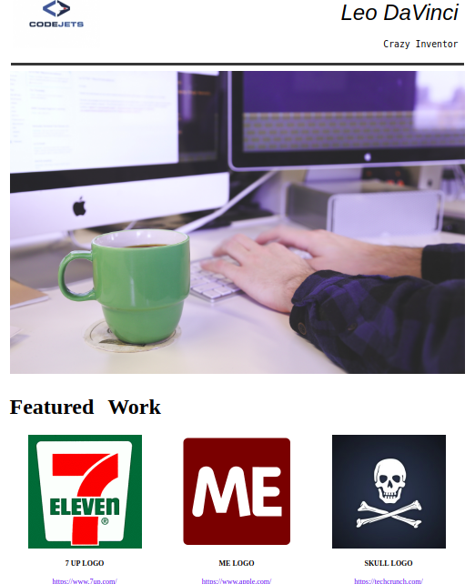

# Gomycode fullstack JS project.

### this project is part of the [the Gomycode.tn](https://gomycode.tn) fullstack JS bootcamp program.

## User Stories

1. <strong>User Story:</strong> A simple web page (not responsive).

    

# What did I learn:

1. HTML and CSS basics.

1. Convert a simple mockup into a web page using HTML and CSS.